<div align="center">
  
  <h1>AiTrainer</h1>
  <p>一个把「训练记录 + 饮食管理 + AI 私教」落地到可上线的全栈 Web 平台</p>
</div>
快速入口：
[在线体验](./README.md#在线体验地址) ｜ [架构概览](./README.md#架构概览) ｜ [界面预览](./README.md#界面预览) ｜ [快速开始](./README.md#快速开始) ｜ [文档中心](./docs/README.md) ｜ [生产部署](./deploy/DEPLOYMENT.md)

## 项目介绍

AiTrainer 面向“想坚持健身但缺少方法与反馈”的人群：把分散的训练、饮食、体态目标整合到一个平台里，帮助用户记录、复盘并持续迭代自己的健身计划。相比只做记录类应用，AiTrainer 的核心在于把数据变成可执行的建议——通过 AI 私教在用户画像、训练日志、饮食记录的基础上给出训练/饮食/综合分析与每日反馈。

本仓库是对旧版 AiTrainer 概念项目的“翻新落地”：补全前后端、数据库与部署链路，形成可本地运行、可 Docker 一键部署、可线上访问的完整网站。

## 旧版演示视频

- 演示视频链接：<【AiTrainer项目旧版演示视频】 https://www.bilibili.com/video/BV1kV5K6ZE6L/?share_source=copy_web&vd_source=8036b1f2d69a8402b96a903666f4ba4a>

## 核心功能

- AI 私教：多会话聊天、意图识别（闲聊/分析）、训练分析/饮食分析/综合分析、历史记录与锚定回复
- 训练模块：训练项目大厅、训练过程页、AI 结算战报（评分/雷达图/纠错快照/热量等，演示数据可由 AI 生成）
- 饮食模块：餐次记录、营养与摄入统计、与 AI 分析联动
- 数据看板：近 7 天卡路里趋势、训练日志、营养配比、AI 每日碎碎念
- 健身社区：动态发布、评论、点赞、收藏、收藏夹（公开/私密）、动态详情页
- 用户体系：JWT 登录注册、首次登录引导、个人主页/用户空间、关注与留言板、隐私设置、邮箱验证码

## 重要说明（能力边界）

- 本项目不包含姿态识别/动作识别算法的开源实现；训练后产生的“动作次数、纠错快照、五维雷达评分”等数据在本仓库中可采用 AI 生成的演示数据用于联调与展示。
- 站点的工程化、数据链路与 AI 私教分析流程为可落地实现：训练/饮食/用户画像等数据会真实入库，并可被 AI 私教用于生成分析建议。

## 技术栈

| 分层 | 技术 |
|---|---|
| 前端 | Vue 3、Vite、Vue Router、Pinia、Element Plus、Axios、ECharts、Marked |
| 后端 | Java 17、Spring Boot 3.2、Spring Security + JWT、Jakarta Validation、MyBatis-Plus、SpringDoc OpenAPI（Swagger UI）、Spring Mail、Redis |
| 数据库 | MySQL 8.0（初始化脚本：`deploy/mysql/init/init.sql`；[数据库文档](./deploy/mysql/DATABASE_SCHEMA.md)） |
| AI | LangChain4j、OpenAI 兼容 Chat API（可通过 `AI_BASE_URL` 接入代理/私有网关） |
| 部署 | Docker / Docker Compose、Nginx（前端静态托管 + `/api` 反向代理）、Let's Encrypt（HTTPS） |

## 架构概览

### 架构图导航

[总览](./README.md#总览可点击模块) ｜ [部署](./README.md#部署架构生产) ｜ [AI 私教](./README.md#ai-私教详细) ｜ [训练](./README.md#训练与战报详细) ｜ [饮食](./README.md#饮食模块详细) ｜ [看板](./README.md#数据看板详细) ｜ [社区](./README.md#社区互动详细)

架构图展示方案（方案 C）：README 默认展示 SVG 静态图；模块跳转通过“图下方的文字链接”完成，避免不同平台对 Mermaid 点击能力支持不一致。

SVG 放置位置（你后续导出后放这里即可生效）：`docs/images/arch-*.svg`

### 总览


模块详图：
[AI 私教](./README.md#arch-ai) ｜ [训练与战报](./README.md#arch-workout) ｜ [饮食模块](./README.md#arch-diet) ｜ [数据看板](./README.md#arch-dashboard) ｜ [社区互动](./README.md#arch-community)

### 部署架构（生产）


<a id="arch-ai"></a>

### AI 私教


LangChain4j 在本项目中主要承担三件事：意图识别、上下文构建（把数据“变成提示词”）、多 Agent 分工（闲聊与分析解耦，便于迭代与评测）。

<a id="arch-workout"></a>

### 训练与战报


<a id="arch-diet"></a>

### 饮食模块


<a id="arch-dashboard"></a>

### 数据看板


<a id="arch-community"></a>

### 社区互动


## 界面预览

**！！！说明：本项目同时适配手机端与电脑端；由于屏幕尺寸与交互差异，UI 会有少量差别，但功能保持一致。**

### AI 私教

功能包括但不限于

1. 结合用户训练数据给用户进行饮食、训练计划进行分析点评，给出建议；
2. 保留对话历史和实现上下文记忆对话等等

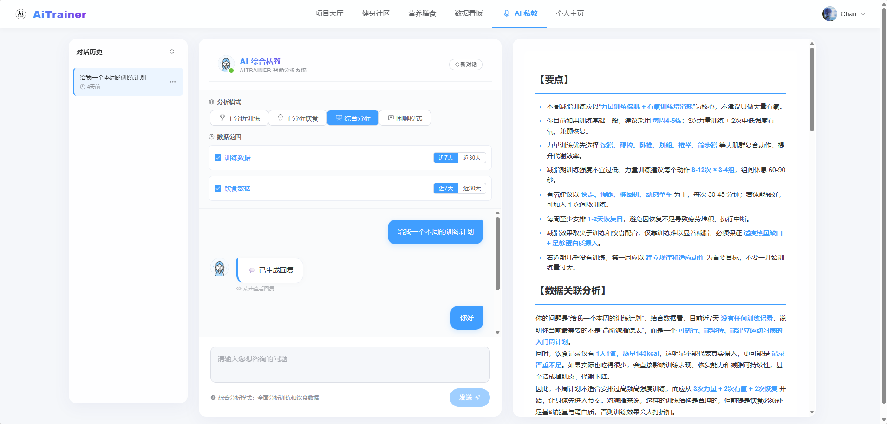

### 训练与战报

功能包括但不限于

1. 调用本地摄像头（可在此处部署姿势识别算法）对运动进行分析；

2. 调用大模型对本次运动消耗的热量、水平进行点评分析等等

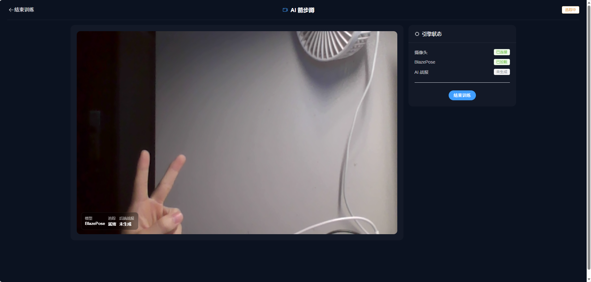 

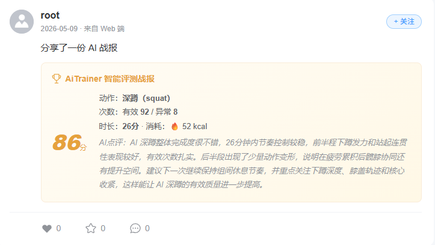

### 饮食

功能包括但不限于

1. 根据用户个人资料和健身目标预估每日应摄入热量（可灵活根据当天进行的运动量进行调整）；
2. 记录当天的饮食，并调用大模型预估摄取的食物热量和碳蛋脂含量，帮助用户进行饮食管控；
3. 记录并额外运动消耗（如跑步）等等

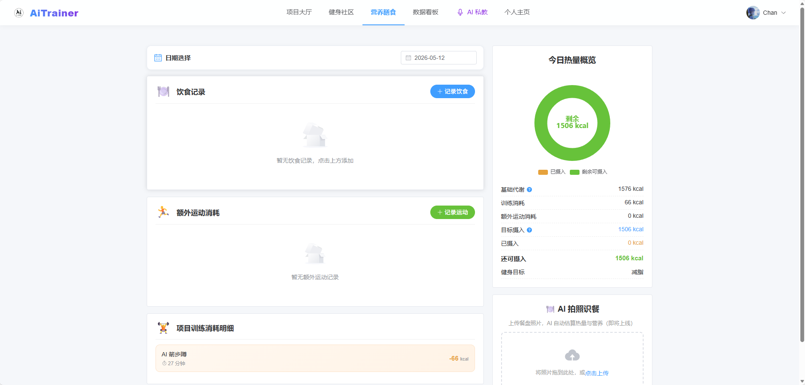

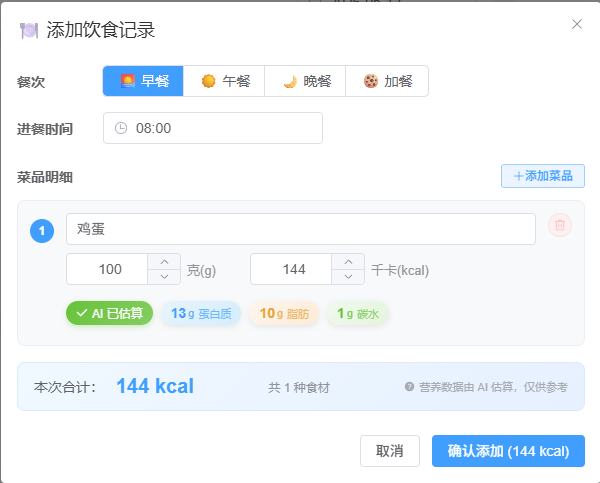


### 数据看板

功能包括但不限于

1. 查看近7天运动消耗和训练情况；
2. 查看当天营养摄入配比，便于用户预估各大营养素的摄取量；
3. 查看项目训练日志、额外运动日志、饮食记录日志等等

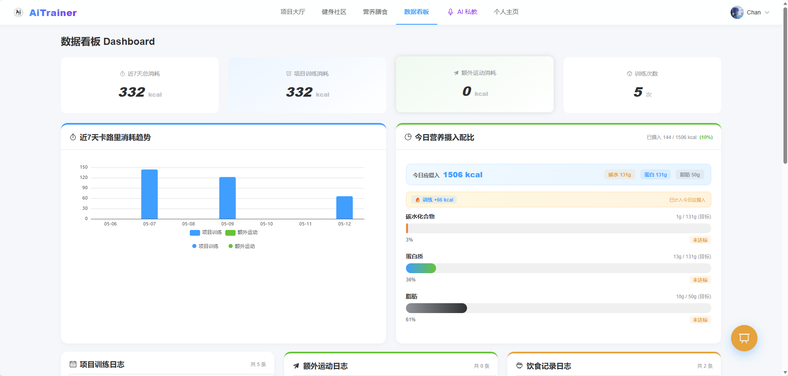


### 健身社区

功能包括但不限于

1. 发表自己的推文（可选择是否携带推文）；
2. 对他人的推文进行评论、点赞、收藏；
3. 关注该用户；
4. 记录打卡日期；
5. 搜索用户、话题、推文内容；
6. ai教练根据当天的时间和训练情况对你提供小小的建议等等

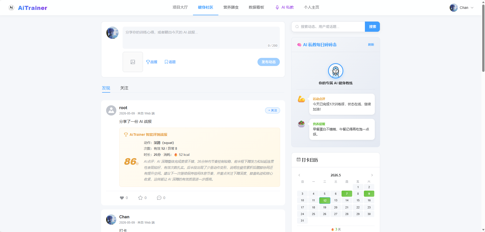 


### 个人主页

功能包括但不限于

1. 编辑个人资料（身高体重，健身目标）；
2. 查看自己发表的推文；
3. 查看自己点赞评论过的推文；
4. 查看编辑自己的收藏夹等等

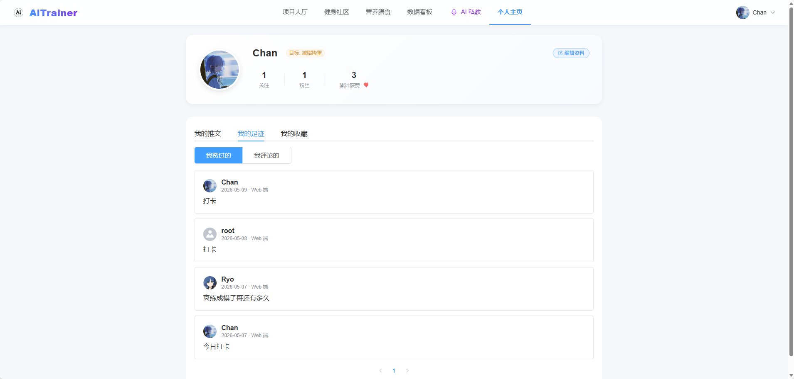 

### 个人空间

功能包括但不限于

1. 本模块和个人空间的区别是：别人点击你的头像访问的是你的空间，可以理解为对外展示的模块；
2. 展示动态：包括推文和训练战报；
3. 查看用户的公开收藏夹；
4. 可以对该用户进行留言互动等等


## 在线体验地址

- Web 站点：<https://aitrainer.fun/>
- API 文档（Swagger UI）：<https://aitrainer.fun/swagger-ui/index.html>
- 如果 Swagger UI 打不开/一直加载中：请检查浏览器或系统代理（VPN/全局代理），建议关闭代理或为 `aitrainer.fun` 设置直连。
- 默认体验账号：`root` / `123456`（不想创建用户时可直接登录体验）

## 获奖情况

- 24 年物联网竞赛国一
- 第 8 届集创赛华南赛区二等奖
- 第 18 届 iCAN 华南赛区二等奖
- 深圳大学创新发展基金合格
- 深圳大学双创之星团队一等奖

## 快速开始

### 方式 A：Docker 一键启动（推荐，最接近线上）

1. 进入部署目录并配置环境变量

```bash
cd deploy
cp .env.example .env
```

2. 启动（首次会构建镜像）

```bash
docker compose up -d --build
```

3. 访问

- 前端：<http://localhost/>
- Swagger UI：<http://localhost/swagger-ui/index.html>
- 后端健康检查（直连后端）：<http://localhost:3000/actuator/health>
- 如果 Swagger UI 打不开/一直加载中：请检查浏览器或系统代理（VPN/全局代理），建议关闭代理或为 `localhost` 设置直连。

### 方式 B：本地开发启动（前后端分开跑）

#### 1）准备依赖

- Java 17 + Maven 3.9+
- Node.js 18+（或与本地环境一致的 LTS）
- MySQL 8 + Redis 7（推荐用 Docker 起）

```bash
cd deploy
cp .env.example .env
docker compose up -d mysql redis
```

上面会自动执行 `deploy/mysql/init/init.sql` 完成建库建表。
数据库表结构文档：`deploy/mysql/DATABASE_SCHEMA.md`。

#### 2）启动后端

确保后端连接信息与 `deploy/.env` 一致（尤其是 `REDIS_PASSWORD`，因为 Compose 启动的 Redis 默认开启密码）：

```bash
# 示例：按你的 deploy/.env 调整（可只设置你改过的项）
export MYSQL_DB=ai_trainer
export MYSQL_USER=aitrainer
export MYSQL_PASSWORD=AiTrainer@2024
export REDIS_PASSWORD=redis123
```

```bash
cd backend
mvn -DskipTests spring-boot:run -Dspring-boot.run.arguments="--spring.profiles.active=dev"
```

后端默认端口为 `3000`，Swagger UI：<http://localhost:3000/swagger-ui/index.html>

#### 3）启动前端

前端默认以 `/api` 作为请求前缀（线上由 Nginx 代理）。本地开发建议二选一：

- 方案 1：在 Vite 开发服务器配置代理（推荐）
- 方案 2：把前端请求地址改成 `http://localhost:3000/api`（仅本地）

Vite 代理配置示例（修改 `frontend/vite.config.js`）：

```js
server: {
  proxy: {
    '/api': {
      target: 'http://localhost:3000',
      changeOrigin: true
    }
  }
}
```

启动命令：

```bash
cd frontend
npm install
npm run dev
```

### 默认体验账号

当数据库为空时，后端启动会自动播种测试账号：

- 用户名：`root`
- 密码：`123456`

## 目录结构

```text
AiTrainer/
├── backend/                 # Spring Boot 后端（API、AI Agent、权限、业务）
├── frontend/                # Vue 3 前端（页面、组件、状态管理）
├── deploy/                  # Docker / Nginx / 一键部署脚本与初始化 SQL
```

## 相关文档

- 生产部署说明：`deploy/DEPLOYMENT.md`
- Docker 部署说明：`deploy/DOCKER.md`
- 数据库表结构说明：`deploy/mysql/DATABASE_SCHEMA.md`
- 文档中心（导航页）：`docs/README.md`

## 安全提示

- 生产环境请务必通过环境变量提供 `JWT_SECRET`、数据库密码、Redis 密码、邮件与 OSS 配置，避免把密钥写进仓库。
- 如曾在本地/仓库中暴露过任何密钥，请立即轮换并清理历史记录。
