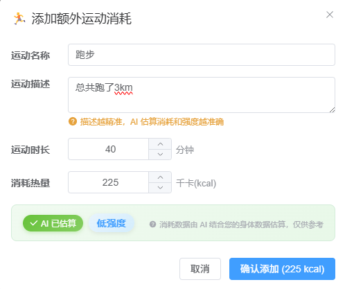
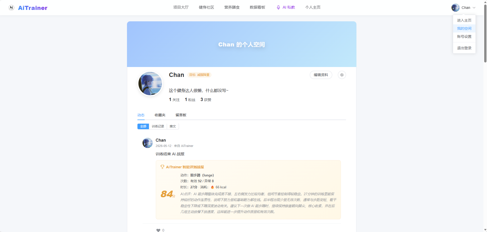

<div align="center">
  
  <h1>AiTrainer</h1>
  <p>A production-ready full-stack web platform that brings together workout logs, diet tracking, and an AI personal trainer</p>
</div>
Quick links:
[Live Demo](./README_EN.md#live-demo) | [Architecture](./README_EN.md#architecture) | [UI Preview](./README_EN.md#ui-preview) | [Quick Start](./README_EN.md#quick-start) | [Docs Hub](./docs/README_EN.md) | [Production Deployment](./deploy/DEPLOYMENT_EN.md)

## Project Overview

AiTrainer is built for people who want to stay consistent with fitness but lack structured methods and feedback. It consolidates workout logs, diet records, and body goals into one platform, helping users record, review, and continuously refine their plans. Beyond simple tracking, AiTrainer focuses on turning data into actionable guidance—an AI coach generates training/diet/comprehensive insights and daily feedback based on user profiles, workout history, and diet records.

This repository is a “rebuild-to-production” version of the original AiTrainer concept project: it completes the frontend, backend, database, and deployment pipeline, resulting in a full website that can run locally, deploy via Docker Compose, and be accessed online.

## Legacy Demo Video

- Video: [AiTrainer (Legacy Version) Demo](https://www.bilibili.com/video/BV1kV5K6ZE6L/?share_source=copy_web&vd_source=8036b1f2d69a8402b96a903666f4ba4a)

## Key Features

- AI Coach: multi-session chat, intent detection (small talk vs. analysis), workout/diet/comprehensive analysis, history anchoring
- Workouts: workout lobby, training session page, AI-generated workout report (scores/radar/correction snapshots/calories; demo data can be generated by AI for integration)
- Diet: meal logging, nutrition & intake stats, integration with AI analysis
- Dashboard: last 7 days calorie trends, workout logs, nutrition breakdown, daily AI notes
- Community: posts, comments, likes, favorites, folders (public/private), post detail page
- Accounts: JWT auth, onboarding flow, profile/user space, follows & guestbook, privacy settings, email verification codes

## Notes (Scope / Limitations)

- This project does not include an open-source implementation of pose/action recognition algorithms. Data such as “rep counts, correction snapshots, 5-dimension radar scores” can be generated as demo data to support integration and UI demonstration.
- The engineering pipeline, data persistence, and the AI-coach analysis workflow are fully implementable: workout/diet/profile data is stored in the database and can be used by the AI coach to generate insights.

## Tech Stack

| Layer | Tech |
|---|---|
| Frontend | Vue 3, Vite, Vue Router, Pinia, Element Plus, Axios, ECharts, Marked |
| Backend | Java 17, Spring Boot 3.2, Spring Security + JWT, Jakarta Validation, MyBatis-Plus, SpringDoc OpenAPI (Swagger UI), Spring Mail, Redis |
| Database | MySQL 8.0 (init script: `deploy/mysql/init/init.sql`; [schema docs](./deploy/mysql/DATABASE_SCHEMA_EN.md)) |
| AI | LangChain4j, OpenAI-compatible Chat API (proxy/private gateway via `AI_BASE_URL`) |
| Deployment | Docker / Docker Compose, Nginx (static hosting + `/api` reverse proxy), Let's Encrypt (HTTPS) |

## Architecture

### Diagram Navigation

[Overview](./README_EN.md#overview) | [Deployment](./README_EN.md#deployment-architecture-production) | [AI Coach](./README_EN.md#ai-coach) | [Workouts](./README_EN.md#workouts--report) | [Diet](./README_EN.md#diet-module) | [Dashboard](./README_EN.md#dashboard) | [Community](./README_EN.md#community)

Architecture diagram approach (Option C): this README shows static SVG diagrams by default; navigation is done via text links below the diagram to avoid differences in Mermaid click support across platforms.

SVG location: `docs/images/arch-*.svg`

### Overview


Module diagrams:
[AI Coach](./README_EN.md#ai-coach) ｜ [Workouts & Report](./README_EN.md#workouts--report) ｜ [Diet](./README_EN.md#diet-module) ｜ [Dashboard](./README_EN.md#dashboard) ｜ [Community](./README_EN.md#community)

### Deployment Architecture (Production)


<a id="arch-ai"></a>

### AI Coach


LangChain4j is used mainly for: intent detection, context construction (turning DB data into prompts), and multi-agent separation (chat vs. analysis) to keep iteration and evaluation easier.

<a id="arch-workout"></a>

### Workouts & Report


<a id="arch-diet"></a>

### Diet Module


<a id="arch-dashboard"></a>

### Dashboard


<a id="arch-community"></a>

### Community


## UI Preview

**Note: This project supports both mobile and desktop. Due to screen sizes and interactions, the UI may differ slightly, while the features remain the same.**

### AI Coach

Key features include (but are not limited to):

1. Generate diet and training advice based on the user’s workout data
2. Persist chat history and support context-aware conversations


### Workouts & Report

Key features include (but are not limited to):

1. Access local camera (pose recognition algorithms can be integrated here) to analyze workouts
2. Use an LLM to estimate calories and provide performance analysis for the session


### Diet

Key features include (but are not limited to):

1. Estimate daily calorie targets based on profile and fitness goals (can be adjusted by the day’s workout volume)
2. Log meals, and use an LLM to estimate calories and macros (P/C/F) for dietary control
3. Track additional exercise burn (e.g., running)




### Dashboard

Key features include (but are not limited to):

1. View the last 7 days workout burn and training status
2. View today’s nutrition breakdown to estimate macro intake
3. View workout logs, extra exercise logs, and meal logs


### Community

Key features include (but are not limited to):

1. Publish posts (optionally attaching workout reports)
2. Comment/like/favorite posts
3. Follow users
4. Track check-in dates
5. Search users, topics, and content
6. Get small daily suggestions from the AI coach based on time and training


### Profile Page

Key features include (but are not limited to):

1. Edit profile (height, weight, fitness goal)
2. View your published posts
3. View posts you liked/commented on
4. Manage your favorites folders


### User Space

Key features include (but are not limited to):

1. Different from the profile page: user space is the public-facing page shown when others click your avatar
2. Show dynamics including posts and workout reports
3. View public favorites folders
4. Leave messages to interact with the user



## Live Demo

- Website: <https://aitrainer.fun/>
- API docs (Swagger UI): <https://aitrainer.fun/swagger-ui/index.html>
- If Swagger UI fails to open or keeps loading: check your browser/system proxy (VPN/global proxy). Disable the proxy or set `aitrainer.fun` to direct.
- Default demo account: `root` / `123456` (for quick access without registering)

## Awards

- 2024 IoT Competition (National First Prize)
- 8th IC Design Contest (South China, Second Prize)
- 18th iCAN Contest (South China, Second Prize)
- SZU Innovation Fund (Qualified)
- SZU Innovation Star Team (First Prize)

## Quick Start

### Option A: Docker One-Click (Recommended, closest to production)

1. Enter the deploy directory and configure environment variables

```bash
cd deploy
cp .env.example .env
```

2. Start (first run will build images)

```bash
docker compose up -d --build
```

3. Access

- Frontend: <http://localhost/>
- Swagger UI: <http://localhost/swagger-ui/index.html>
- Backend health check (direct): <http://localhost:3000/actuator/health>

### Option B: Local Development (frontend/backend separately)

#### 1) Prerequisites

- Java 17 + Maven 3.9+
- Node.js 18+ (or your preferred LTS)
- MySQL 8 + Redis 7 (recommended via Docker)

```bash
cd deploy
cp .env.example .env
docker compose up -d mysql redis
```

The above will run `deploy/mysql/init/init.sql` to create DB schema automatically.
Database schema docs: `deploy/mysql/DATABASE_SCHEMA_EN.md`.

#### 2) Start Backend

Ensure backend connection settings match `deploy/.env` (especially `REDIS_PASSWORD`, since the Compose Redis enables password by default):

```bash
# Example: adjust values based on your deploy/.env
export MYSQL_DB=ai_trainer
export MYSQL_USER=aitrainer
export MYSQL_PASSWORD=AiTrainer@2024
export REDIS_PASSWORD=redis123
```

```bash
cd backend
mvn -DskipTests spring-boot:run -Dspring-boot.run.arguments="--spring.profiles.active=dev"
```

Backend default port: `3000`. Swagger UI: <http://localhost:3000/swagger-ui/index.html>

#### 3) Start Frontend

The frontend uses `/api` as the default prefix (proxied by Nginx in production). For local development:

- Option 1: configure a Vite dev-server proxy (recommended)
- Option 2: change the frontend base URL to `http://localhost:3000/api` (local only)

Vite proxy example (`frontend/vite.config.js`):

```js
server: {
  proxy: {
    '/api': {
      target: 'http://localhost:3000',
      changeOrigin: true
    }
  }
}
```

Start commands:

```bash
cd frontend
npm install
npm run dev
```

### Default Demo Account

When the database is empty, the backend seeds a demo account on startup:

- Username: `root`
- Password: `123456`

## Repository Structure

```text
AiTrainer/
├── backend/                 # Spring Boot backend (API, AI agents, auth, business logic)
├── frontend/                # Vue 3 frontend (pages, components, state)
├── deploy/                  # Docker / Nginx / one-click deployment scripts + init SQL
```

## Documentation

- Production deployment: `deploy/DEPLOYMENT_EN.md`
- Docker deployment: `deploy/DOCKER_EN.md`
- Database schema: `deploy/mysql/DATABASE_SCHEMA_EN.md`
- Docs hub (index): `docs/README_EN.md`

## Security Notes

- For production, always provide `JWT_SECRET`, database passwords, Redis password, mail and OSS configs via environment variables—do not commit secrets to the repository.
- If any secret has ever been exposed locally or in the repo, rotate it immediately and clean up history.
